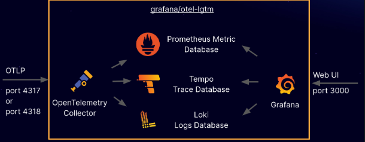

# OpenTelemetry coletando logs, trace e metricas

Este projeto é uma implementação completa de observabilidade usando a stack OpenTelemetry em conjunto com Grafana, Prometheus, Loki e Tempo. Ele permite coletar, armazenar e visualizar logs, métricas e trace de aplicações que neste caso a aplicação é em Python.

## Arquitetura


## Stack
- OpenTelemetry Collector 
- Prometheus (Coleta de métricas)
- Tempo (Coleta de Trace)
- Loki (Coleta de log)

## Pré-requisitos
* Docker
* Python:3.10

## Como instalar o Docker?

https://www.youtube.com/playlist?list=PLbPvnlmz6e_L_3Zw_fGtMcMY0eAOZnN-H

## Como baixar o projeto?
Clone o repositório:
```
git clone https://github.com/wlcamargo/opentelemetry
```
Entre na pasta do projeto:
```
cd opentelemetry
```

## Como criar e ativar o ambiente virtual?
Execute o comando para criar o ambiente virtual:
```
python3 -m venv venv
```
Execute o comando para ativar o ambiente virtual (Linux):
```
source venv/bin/activate
```

## Como instalar as libs necessárias?
```
pip install -r requirements.txt
```

## Como executar o script para testar a comunicação com o coletor do OpenTelemetry?

Todos os arquivos estão na pasta ```src```

## Como acessar os serviços?

### Grafana
localhost:3000 

#### Credenciais Grafana
____________________________

login: admin

password: admin

____________________________

## Prometheus
localhost: 9090

## Referências
https://www.youtube.com/watch?v=9mifCIFhtIQ&list=PLOQgLBuj2-3IL2SzHv1CHaBBHJEvHZE0m

https://hub.docker.com/r/grafana/otel-lgtm

https://docs.docker.com/engine/cli/otel/

https://github.com/open-telemetry

https://grafana.com/

https://grafana.com/oss/opentelemetry/

## Developer
| Desenvolvedor      | LinkedIn                                   | Email                        | Portfólio                              |
|--------------------|--------------------------------------------|------------------------------|----------------------------------------|
| Wallace Camargo    | [LinkedIn](https://www.linkedin.com/in/wallace-camargo-35b615171/) | wallacecpdg@gmail.com        | [Portfólio](https://wlcamargo.github.io/)   |
